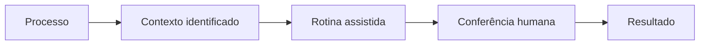

[README (1).md](https://github.com/user-attachments/files/31665284/README.1.md)

  <h1>SEI +</h1>

  <h3>O trabalho flui. A tecnologia cuida do repetitivo.</h3>

  

    Uma extensão que conecta <strong>SEI</strong> e <strong>SIAT</strong>, automatiza rotinas tributárias 
    e transforma tarefas operacionais em fluxos simples, rápidos e seguros.
  

  

    
  

  

    
    
    
  

---

## O problema

Grande parte do trabalho realizado em processos tributários não está na análise em si, mas no caminho até ela.

É preciso alternar entre sistemas, localizar cadastros, copiar informações, percorrer menus, emitir documentos, conferir dados e repetir as mesmas sequências diversas vezes ao longo do dia.

São tarefas necessárias, mas que consomem tempo, aumentam a possibilidade de erros e afastam o servidor da atividade que realmente exige conhecimento: **analisar, decidir e produzir resultados**.

## A solução

O **SEI +** cria uma camada de integração e automação sobre a rotina de trabalho.

Com o processo aberto no SEI, a extensão identifica o contexto da atividade e disponibiliza ações relacionadas ao SIAT, cálculos, documentos e comunicações. O usuário deixa de navegar por vários caminhos para executar uma rotina e passa a conduzi-la a partir de um fluxo único e assistido.

> **O SEI + não substitui a decisão humana. Ele elimina o trabalho mecânico que existe ao redor dela.**

## Uma nova experiência de trabalho

| Antes | Com o SEI + |
| --- | --- |
| Alternar constantemente entre SEI e SIAT | Trabalhar a partir do contexto do processo |
| Repetir consultas e preenchimentos | Acionar rotinas automatizadas |
| Copiar dados manualmente entre sistemas | Reaproveitar informações já disponíveis |
| Refazer cálculos e conferências | Utilizar cálculos padronizados e rastreáveis |
| Preparar comunicações uma a uma | Gerar comunicações a partir do andamento |
| Triar documentos manualmente | Receber apoio na identificação e classificação |

## O que o SEI + entrega

### 🔗 Integração entre SEI e SIAT

Os dois sistemas passam a participar do mesmo fluxo de trabalho. Informações do processo orientam consultas e ações no ambiente tributário, reduzindo a navegação e a transcrição manual de dados.

### ⚡ Automação de rotinas repetitivas

Sequências operacionais extensas podem ser executadas de maneira assistida, mantendo o usuário informado e no controle das etapas relevantes.

### 🧮 Atualização de tributos a restituir

Uma calculadora integrada auxilia a atualização dos valores, padroniza critérios e facilita a conferência dos resultados utilizados na instrução do processo.

### 🧾 Emissão de guias

Dados já disponíveis podem ser aproveitados na preparação e emissão de guias, reduzindo preenchimentos duplicados e falhas de digitação.

### ✉️ Comunicações automáticas

E-mails relacionados ao andamento do processo podem ser preparados de forma padronizada, com as informações adequadas a cada situação e revisão antes do envio.

### 🤖 Triagem inteligente de processos e documentos

O robô de triagem auxilia na identificação do tipo de demanda, dos documentos apresentados e das informações que precisam ser verificadas, permitindo que o processo chegue à análise mais organizado.

## Do processo ao resultado

Cada módulo compartilha a mesma ideia central: **utilizar o que o sistema já sabe para evitar que o usuário faça novamente o que a tecnologia pode executar por ele**.

## Impacto esperado

| ⏱️ Tempo | 🎯 Qualidade | 🧠 Foco | 📐 Padronização |
| :---: | :---: | :---: | :---: |
| Menos etapas operacionais | Menos erros de transcrição | Mais atenção à análise | Rotinas executadas de forma consistente |

O ganho não está apenas em fazer mais rápido. Está em criar um ambiente de trabalho no qual o conhecimento do servidor seja empregado onde realmente produz valor.

## Princípios do produto

- **O usuário permanece no controle:** ações relevantes devem ser compreendidas e confirmadas.
- **Automação com propósito:** cada recurso deve eliminar uma dificuldade real da rotina.
- **Simplicidade na experiência:** menos telas, menos etapas e informações no momento certo.
- **Confiabilidade:** resultados devem ser claros, conferíveis e rastreáveis.
- **Proteção das informações:** dados tributários e administrativos devem ser tratados com responsabilidade.
- **Evolução contínua:** novas rotinas podem ser incorporadas conforme as necessidades do trabalho.

## Visão do produto

O **SEI +** nasce da observação direta do trabalho cotidiano e de um princípio simples:

> Se uma tarefa é repetitiva, previsível e baseada em regras, ela pode ser assistida pela tecnologia. Se exige interpretação, responsabilidade e julgamento, deve permanecer nas mãos do servidor.

A extensão pretende reunir, em uma única experiência, as ferramentas necessárias para tornar a tramitação tributária mais fluida — da chegada do processo à entrega do resultado.

---

  <h3>SEI +</h3>

  

    <strong>Integração que simplifica. Automação que libera tempo. 
    Tecnologia que valoriza o trabalho humano.</strong>
  

